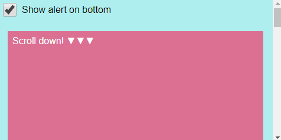
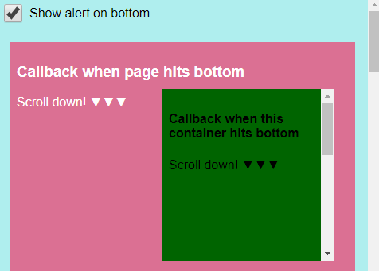

# react-bottom-scroll-listener  [](https://www.npmjs.com/package/react-bottom-scroll-listener) [](https://github.com/karl-run/react-bottom-scroll-listener)

A simple **React hook** and **React component** that lets you listen for when you have scrolled to the bottom.

### Window



### Container



## Installation

npm:
`npm install react-bottom-scroll-listener`

yarn:
`yarn add react-bottom-scroll-listener`

## Migrating to V5

Version 5 is only a refactor for the hook to use an options parameter, instead
of relying of function parameters which were starting to get out of hand.

#### If you are using the component, there are no breaking changes

If your hook looks like this:

```tsx
useBottomScrollListener(callback, 0, 200, undefined, true);
```

You will have to change it to use the options parameter:

```
useBottomScrollListener(callback, {
  offset: 100,
  debounce: 0,
  triggerOnNoScroll: true
})
```

Remember that you can omit any values that are using the defaults! The defaults are ase following:

```
  offset: 0,
  debounce: 200,
  debounceOptions: { leading: true },
  triggerOnNoScroll: false,
```

So for the average use case, you are probably only setting one of these values, so your hook
might look like this:

```
useBottomScrollListener(callback, { triggerOnNoScroll: true })
```

You can refer to the Usage-section for more details.

## Usage

### Hook

[Full example](/example/src/HookExample.js)

#### On bottom of entire screen

Use the hook in any functional component, the callback will be invoked
when the user scrolls to the bottom of the document

```jsx
import { useBottomScrollListener } from 'react-bottom-scroll-listener';

useBottomScrollListener(callback);
```

#### On bottom of specific container

Use the hook in any functional component, use the ref given from the hook
and pass it to the element you want to use as a scroll container

The callback will be invoked when the user scrolls to the bottom of the container

```jsx
import { useBottomScrollListener } from 'react-bottom-scroll-listener';

const scrollRef = useBottomScrollListener(callback);

<div ref={scrollRef}>Callback will be invoked when this container is scrolled to bottom.</div>;
```

**Parameters**

```
useBottomScrollListener<T extends HTMLElement>(
  // Required callback that will be invoked when scrolled to bottom
  onBottom: () => void,
  // Options, entirely optional, you can provide one or several to overwrite the defaults
  options?: {
    // Offset from bottom of page in pixels. E.g. 300 will trigger onBottom 300px from the bottom of the page
    offset?: number
    // Optional debounce in milliseconds, defaults to 200ms
    debounce?: number
    // Overwrite the debounceOptions for lodash.debounce, default to { leading: true }
    debounceOptions?: DebounceOptions
    // If container is too short, enables a trigger of the callback if that happens, defaults to false
    triggerOnNoScroll?: boolean
  },
); // returns React.MutableRefObject Optionally you can use this to pass to a element to use that as the scroll container
```

### Component

[Full example](/example/src/ComponentExample.js)

#### On bottom of entire screen

Simply have the BottomScrollListener anywhere in your application and pass it a function as `onBottom`-prop.

```jsx
import BottomScrollListener from 'react-bottom-scroll-listener';

<BottomScrollListener onBottom={callback} />;
```

#### On bottom of specific container

Pass the BottomScrollListener a function inside the JSX_tag, receive the `scrollRef` in this function from the BottomScrollListener
and pass it to the component you want to listen for a scroll event on.

```jsx
import BottomScrollListener from 'react-bottom-scroll-listener';

<BottomScrollListener onBottom={callback}>
  {(scrollRef) => <div ref={scrollRef}>Callback will be invoked when this container is scrolled to bottom.</div>}
</BottomScrollListener>;
```

> Those are some weird children, what's going on?

This pattern is called "function as a child". What this allows is that the BottomScrollListener can pass you a `React.RefObject`. This
`React.RefObject` can then be passed to whatever component you want to be notified when you hit the bottom of. Without this it would be
difficult to attach event listeners for scrolling to an arbitrary element.

**Props**

| Property          |           Type           |     Default     | Description                                                                                                                                                                                                                                                                                 |
| ----------------- | :----------------------: | :-------------: | ------------------------------------------------------------------------------------------------------------------------------------------------------------------------------------------------------------------------------------------------------------------------------------------- |
| onBottom          |         Function         |      null       | **(required):** callback invoked when bottom is reached                                                                                                                                                                                                                                     |
| debounce          |          number          |       200       | milliseconds, how much debounce there should be on the callback                                                                                                                                                                                                                             |
| offset            |          number          |        0        | offset from bottom in pixels. E.g. 300 if it should invoke `onBottom` 300px before the bottom.                                                                                                                                                                                              |
| debounceOptions   |     DebounceOptions      | {leading: true} | see the lodash.debounce options: see https://lodash.com/docs/4.17.15#debounce                                                                                                                                                                                                               |
| triggerOnNoScroll |         boolean          |      false      | if container is too short, enables a trigger of the callback if that happens                                                                                                                                                                                                                |
| children          | React.Node _or_ Function |      null       | Not required, but you can use this to wrap your components. Most useful when you have some conditional rendering. If this is a function, that function will receive a React.RefObject that _needs_ to be passed to a child element. This element will then be used as the scroll container. |

# Migrating from 2.x.x to 3.x.x

There are no breaking changes except that the required version of React is now 16.8.0. If you are on an
older version of React you can either upgrade React, or stay on version 2.x.x. If you already
are on a newer version of React you don't have to do anything, except maybe try out the new hook implementation. :)
